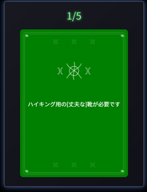

Rust & WebAssembly製の単語帳アプリ 🃏
==============
RustとWebAssembly（Wasm）で構築された、軽量でサクサク動く単語帳アプリです。 サンプルとして英単語を登録していますが、ITEMの中身を書き換えるだけで、自分専用の学習ツールにカスタマイズできます。

[](https://myurioka.github.io/card/)

[Play in browser](https://myurioka.github.io/card)

### 操作方法

めくる： カードをタップ（クリック）すると裏返り、答えが表示されます。

左へスワイプ（ドラッグ）： 「覚えた！」（完了）

右へスワイプ（ドラッグ）： 「まだ不安…」（後で再確認）

リスタート： 最後のカードをタップすると、最初からやり直せます。

### Requirement
  * Rust, Cargo
  * WASM

### How to Build & Run

  ```sh
  $ cd card
  $ pnpm build-wasm
  $ pnpm dev --open
  ```

  Browse http://localhost:5173