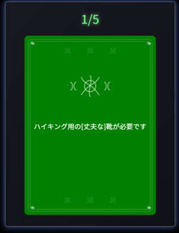

Rust & WebAssembly製の単語帳アプリ 🃏
==============
RustとWebAssembly（Wasm）で構築された、軽量でサクサク動く単語帳アプリです。 サンプルとして英単語を登録していますが、ITEMの中身を書き換えるだけで、自分専用の学習ツールにカスタマイズできます。

[](https://myurioka.github.io/card/)

[Play in browser](https://myurioka.github.io/card)

### 操作方法

めくる： カードをタップ（クリック）すると裏返り、答えが表示されます。

左へスワイプ（ドラッグ）： 「覚えた！」（完了）

右へスワイプ（ドラッグ）： 「まだ不安…」（後で再確認）

マウスの右ボタン： 左へスワイプと同じ「覚えた！」（完了）

キーボード： ← キーで「覚えた！」（完了）、→ キーで「まだ不安…」（後で再確認）

リスタート： 最後のカードをタップすると、最初からやり直せます。

### Requirement
  * Rust, Cargo
  * WASM

### How to Build & Run

  ```sh
  $ cd card
  $ pnpm build-wasm
  $ pnpm dev --open
  ```

  Browse http://localhost:5173

### カードの追加方法

Claude Code のスラッシュコマンド `/add-card`（[.claude/commands/add-card.md](.claude/commands/add-card.md)）を使うと、カードを1枚ずつ追加できます。

1. テンプレートをコピーしてリクエストファイルを作る

   ```sh
   $ cp requests/template_add_card.md requests/YYYYMMDD_add_card.md
   ```

2. `requests/YYYYMMDD_add_card.md` の「リクエスト内容」「SVG出力先」「備考」を埋める
   - 表面（問題文）と裏面（答え）の内容を書く
   - わからない項目は「未定」でOK（実装時に質問されます）

3. Claude Code でコマンドを実行する

   ```
   /add-card requests/YYYYMMDD_add_card.md
   ```

   リクエストファイルを使わず、文章を直接渡すこともできます。

   ```
   /add-card 電線の抵抗率を覚えるカードを追加して
   ```

4. Claude Code が次の作業を行います
   - 裏面の SVG を `public/characters/<name>.svg` に作成
   - `src/wasm/src/common.rs` の `ITEMS` の末尾にカードを追加し、`FLASH_CARD_NUMBERS` を 1 増やす
   - `npm run build-wasm` でビルド確認、SVG のカラーパレットチェック

5. 内容を確認して、動作を確かめる

   ```sh
   $ pnpm dev --open
   ```

※ コミットは自動では行われません。内容を確認してから自分でコミットしてください。
